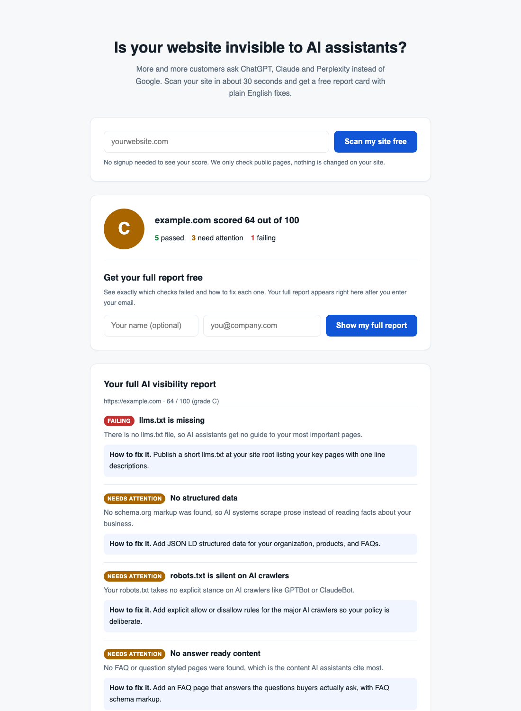

# AI Visibility Report

**Live at [scan.asishsingh.in](https://scan.asishsingh.in)**

A free web tool that answers one question for any website owner, how visible is my site to AI assistants like ChatGPT, Claude, and Perplexity? Enter a web address, get a grade out of 100 in about 30 seconds, and unlock a full plain English report that explains every check and how to fix it.



It is the public face of my open source [agent-readiness-auditor](https://github.com/asish-singh/agent-readiness-auditor), which normally runs on the command line. This wraps the same nine check audit in a page anyone can use, no technical knowledge needed.

## Why it exists

More buying research now happens inside AI assistants instead of search engines. A site that AI systems cannot read well simply does not appear in those answers, and most owners have no idea where they stand. This tool makes that visible in one scan, and the full report doubles as an introduction to my AI SEO consulting practice. It is a classic lead magnet, free genuine value up front, contact details exchanged for the deeper report.

## How it works

1. A visitor enters their website address. The server runs the auditor against the site's public pages, nothing is changed or probed beyond what any crawler sees.
2. They instantly see their grade and how many checks passed, need attention, or failed.
3. Entering an email unlocks the full report on screen, every finding explained in plain language with a concrete fix.
4. Each submission is committed to a private repository through the GitHub API, so the app itself stores nothing. The server holds a fine grained access token (scoped to that one repository) supplied through a `.env` file that is never committed.

## Product decisions worth noting

- **Teaser before email.** The score is free with no signup, only the detailed findings sit behind the email. Showing real value first converts better than a wall.
- **No email promises.** The report appears on screen immediately. Nothing claims to be sent by email, so there is no delivery infrastructure to build or break.
- **Leads live in git.** Every lead is a commit in a private repo, which gives history, timestamps, and zero database to run. The hosting server stays stateless and disposable.
- **The report never blocks on lead storage.** The visitor gets their report instantly, the GitHub save happens in the background, and a failure is logged rather than shown.

## Run it locally

```
npm install
npm start
```

Open http://localhost:3000 and scan any website. Without a `GITHUB_TOKEN` in `.env`, everything works except lead storage, submissions are logged to the console instead.

| Variable | Purpose |
| --- | --- |
| `GITHUB_TOKEN` | Fine grained token with Contents read and write on the leads repository |
| `PROSPECTS_REPO` | Repository that receives leads, as `owner/name` |
| `PORT` | Port to listen on, defaults to 3000 |

## Stack

Plain Node.js with Express, a single static HTML page, and the auditor imported as an npm dependency. No build step, no database, no framework.

## Related work

- [agent-readiness-auditor](https://github.com/asish-singh/agent-readiness-auditor), the scoring engine, also an MCP server
- [The Agentic Web Index](https://asishsingh.in/agentic-web-index/), my quarterly benchmark of 200 sites on the same checks
- [ai-search-playbook](https://github.com/asish-singh/ai-search-playbook), the full methodology, published openly

## License

MIT
